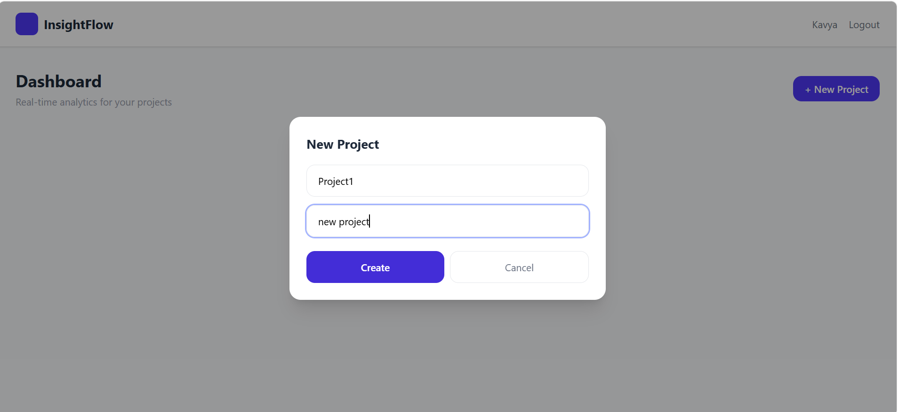
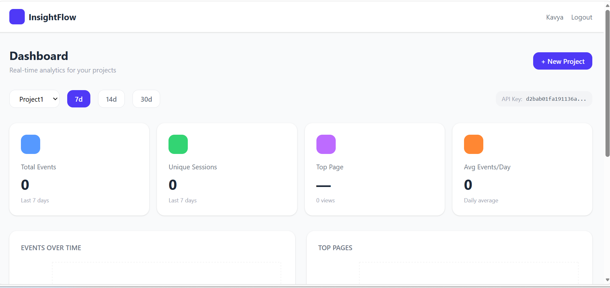

# InsightFlow — Real-Time Analytics Dashboard

A production-grade analytics platform built with React, TypeScript, 
Node.js, Python, PostgreSQL, MongoDB, GraphQL, and AWS.

## Tech Stack
- *Frontend*: React, TypeScript, Apollo Client, Recharts, Tailwind
- *Backend*: Node.js, Express, GraphQL, JWT Auth
- *Data Service*: Python FastAPI (aggregation & reporting)
- *Databases*: PostgreSQL (users/projects), MongoDB (events)
- *Cloud*: AWS EC2, RDS, S3, Lambda
- *CI/CD*: GitHub Actions

## Quick Start

### Prerequisites
- Docker + Docker Compose
- Node 20+
- Python 3.11+

### Run locally
cp .env.example .env
docker-compose up --build

### Services
| Service         | URL                    |
|-----------------|------------------------|
| Backend API     | http://localhost:4000  |
| Python Service  | http://localhost:8000  |
| Frontend        | http://localhost:5173  |

